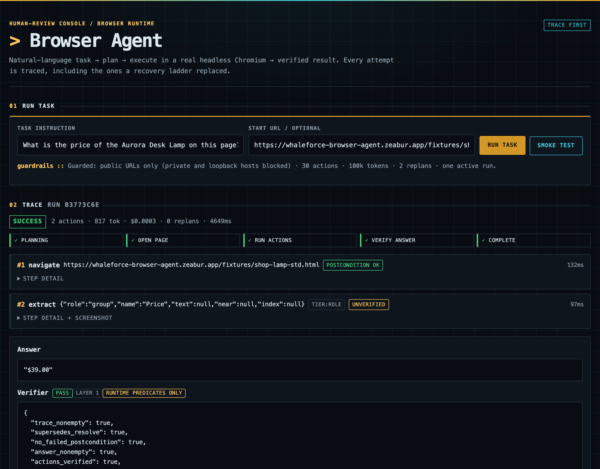

# browser-agent

A browser automation agent that takes a natural-language task, plans it against
what the page actually shows, executes it in a real headless Chromium, and then
**has a separate component decide whether it worked**.

**Live:** https://whaleforce-browser-agent.zeabur.app/ — submit a task, watch the
trace stream, open a failed step and its screenshot.



Eval-first: reliability here has no public ground truth, so correctness is
encoded as executable invariants and golden/adversarial cases instead of prose.

---

## The one idea

Most of this repo exists to answer a single question: **how do you know the
agent didn't just say something plausible?**

An agent that grades its own work will report success. So the executor never
does. A run's status is assembled by a separate `OutcomeVerifier` that reads
raw evidence — what was extracted, and what the page said *where* it was
extracted — never the executor's conclusion. Three invariants hold that line:

| | |
|---|---|
| **INV-0** | `success` requires a non-empty answer **and** a non-empty trace. An empty extraction is `failure:extract`, never a quiet success. |
| **INV-2** | A non-PASS verdict can never be reported as `success`. The verifier outranks the executor. |
| **INV-3** | Every budget exhaustion ends the run with a failure class and the full trace — never a quiet stop. |

Each is backed by a case that has been watched go red. An invariant with no
failing case is decoration.

## Running it

```bash
python3 -m evals.run --suite fast        # offline gate: 268 cases, zero paid calls
python3 -m evals.run --suite invariant   # must-always-hold; pure-code probes + the fixture runs that pin them
python3 -m evals.run --suite live        # 13 cases, 5 real sites, still $0.00
```

The reviewer UI locally — task submission needs `OPENROUTER_API_KEY`; the
guards, matrix and browser smoke test work without one:

```bash
python3 -m uvicorn src.browser.server:app --port 8099
```

## Where it stands

Latest offline baseline — `evals/report/20260829-135152-fast.json`, with
`evals/report/20260829-134919-invariant.json` and
`evals/report/20260828-153810-live.json`:

```
fast  268/268    invariant  112/112    live  12/13    $0.0000    105.2s
recovery 10/10 verified (25 rungs tried) · mutation 9/11 passed, 6 recovered (5 by relocating)
diagnosis 77/77 · 15 replans
```

The fast and invariant refreshes are green after publishing the new 112-case
invariant count and band.

This refresh supersedes the prior baselines
`evals/report/20260828-161325-fast.json`,
`evals/report/20260828-161359-invariant.json`, plus the intermediate
`evals/report/20260829-032810-invariant.json`,
`evals/report/20260829-130008-invariant.json` and
`evals/report/20260829-134759-invariant.json`; they remain as historical
evidence rather than inputs to the current figures.
The immediately preceding fast report,
`evals/report/20260829-033600-fast.json`, was 265/268; its three reds were the
derived count, band and ADR scope refreshes that the green baseline above closes.

`live` is not part of the gate, and it goes red when a site is having a bad
day rather than being stubbed around it (CLAUDE.md rule 4) — an earlier run of
this block was 8/9 because `live-ol-search-a11y-invisible` exceeded the 20s
navigation budget while openlibrary.org was answering its bare home page in
~9.5s to `curl`.

Every number in that block is recomputed from those three report files by
`docs-numbers-are-derived`, so it can only go stale by citing a stale report —
which is how it went stale last time (PR #23 R4).

That is this machine, where seven runs of the merged tree measured
**59.62 / 59.69 / 59.70 / 59.79 / 59.83 / 59.85 / 60.28s** — one of the seven
over the 60s ceiling, and that run exited non-zero for exactly that reason. The
runs since (`ui-rendered` moved back onto the shared Chromium, PR #23 R5)
are **58.96 / 59.20 / 59.27 / 59.31 / 59.32 / 59.33 / 59.54 / 59.56 / 59.60 /
59.61 / 59.67 / 59.67 / 59.88 / 60.18 / 60.64s** across three independent
measurers — 13 of 15 under, two over, the slowest 0.64s past the ceiling. The
first version of this paragraph published the first two of those runs as
"59.56 / 59.60s" and was falsified inside the same review round by a run at
60.64s; this is a sample, not a bound, and the honest statement is that this
suite straddles its ceiling rather than clears it. The same suite on CI
(ubuntu-latest) measured **113.51 / 116.01 / 117.14 / 117.84s** — the four
slowest of the 17 `fast` figures in the window ADR-019 §5 names by its endpoints
(19 runs, two of which breached on `invariant` and so never reached the `fast`
step), on a runner that is not this laptop,
which is why the wall-clock ceiling is per-environment rather than one number
pretending to be portable. The slowest is eval-gate run 33119009870; the ids and
case counts of all four are in ADR-019 §5, hand-read off their logs. Since §9
(2026-08-28) the sample is measured RUNS across commits rather than repeated
attempts of one run: the run that set `invariant`'s ceiling, 33165425989, exited
at the `invariant` step with `37.44s` against `101/101` passing, so it produced no
`fast` figure at all — and a table that pairs the two suites per row can only
hold that observation by dropping it. That run is ONE row although it was
re-run three times (37.44 / 37.42 / 35.26s): §9 samples runs, not attempts, so
the three collapse to their slowest — which is also the conservative direction
for a ceiling, and the reason the third attempt was taken at all, since it
raised the maximum the first two had suggested. They supersede an earlier CI band published
here — 59.77 / 60.84 / 64.61 / 64.67s — which was measured on a 95-case tree and
so cannot describe this one. That band is NOT unevidenced, and an earlier
revision of this paragraph struck it on that ground: ADR-013 names its run
(commit `09b9740`, run `32455716866` and three re-runs) and all four numbers
reproduce verbatim from that run's attempts. It is superseded by a later
measurement, which is a different thing from being unsupported, and this file no
longer says otherwise (PR #41 R3; ADR-013's own copy of the band is scoped on
`task/T-M32-9`, which owns that file).
CI's ceiling is the slowest observed run plus 15%, measured on CI at the case
count of the commit ADR-019 §5 names — which since 2026-08-26 is the commit this
branch ships, so ~~90s ... at the case count of the commit named there, not this
one~~ is struck [historical] (PR #57 R32: both halves were false, the number and
the qualifier). §5 publishes the live figure; it is not repeated here. The local
ceiling was the original **60s** through M30 — a straddling band briefly pushed it to 70, but round-5 review could not
reproduce the two runs that justified that (~22 runs across three
independent measurers, idle and under deliberate CPU load, all landed at
58.96-59.87s), so the amendment was withdrawn — though not cleanly: 21
further post-commit runs found the honest band is 58.83-60.26s, one run
over the line by a few tenths and unexplained by load. Both bands are
ADR-013's, Decision 4's round-5 correction and Decision 5's post-commit
sample; they predate the convention that a published figure cites a
committed report (ADR-012), so the ADR is the record and no report file
will ever back them (T-M32-5).

**M31 grew the suite and the 60s ceiling stopped being tenable.** It refused a
commit that changed nothing but JSON, at 60.24s, with 109/109 passing
(ADR-019 Decision 1's opening). The
first repair moved three browser cases to `invariant`-only tags, which took
~4.9s out of the measured number and left the gate a coin flip while the
published `fast` figure stayed at 59.7s — the wrong instrument. The cases are
back in `fast` and the ceilings are re-measured instead
([ADR-019](specs/decisions/ADR-019-wall-clock-ceilings-per-suite.md)), by
ADR-013's own rule: slowest observed run +15%, rounded up to a multiple of five.

**Every LOCAL band below is computed from `evals/report/history.jsonl`**, the
ledger committed in this repo, and `published-band-matches-the-ledger` grades
that on every run. What it requires is listed in
[ADR-019 §6](specs/decisions/ADR-019-wall-clock-ceilings-per-suite.md); the
sentences here name its items rather than re-state them, and item 8 (references)
grades those names: a reference spells a number the list has and that item's
slug, so a bare name, a name for an item that does not exist and a name aimed at
the wrong rule are all red. A paragraph that paraphrases a rule and names no
item is caught by nothing, which is why §6 says so in those words.
Every row written since T-R44 carries the environment
that measured it — a row older than that reads as `local`, which all of them are
— and item 9 (environment) grades a band only against its own environment. CI's
`invariant` row, appended to the job's copy of the file by the step before, used
to redden a band measured here: `ts` was naive local time compared as a string, so
that row followed the band row by 25 minutes and sorted eight hours before it,
and being clean it answered "a clean row was already available by then". The
ordering bug behind it is fixed too, in the same PR and separately: `ts` is
stamped in UTC now, so the comparison compares what it claims to (T-M32-13).
ADR-019 §7 has the mechanism, the control, and why these are two properties
rather than one. It is a property, not a
snapshot, because the ledger grows on every gate
run; a list of times would go red on the next run instead of on a regression. It
exists because three bands in PR #29 did not match the ledger beside them, and
one ceiling was derived from a maximum that was never measured (R18, R21) — the
same selective presentation ADR-013 Decision 4 was withdrawn over.

CI's two numbers below are NOT in this ledger and cannot be: no CI run commits
its wall clock, so they are measured by hand off the log of the eval-gate run
ADR-019 §5 names, and recorded with that id there; §5 also carries the
`gh run view … --attempt N --log` command that reprints them. The id is not
repeated in this paragraph: for one round this file cited a retired run here and
the current one thirty-six lines below, so the command a reader could copy
returned cells that matched nothing published (PR #57 R26). §5's table is the one source and
`ci-numbers-are-derived` grades it: the four values, both ranges and the ceilings
below are read back from that table, the run id has to appear here as well as
there, and the ceilings must be the ones the workflow declares — so these numbers
can no longer drift from ADR-019's, in either direction. What is still not graded,
and cannot be from here, is that anyone ever measured them; the run id is what a
reader checks instead, and ADR-019 §7 says why this repo does not make CI commit
a row.

§6 item 3 (same-ceiling) is why the published number can sit below the slowest
CITABLE row, by at most one ceiling step (**4.35s**). Against the raw maximum
over EVERY row that gap has no bound at all, because a row no band may legally
cite is compared against nothing — ADR-019 §8 is the ruling and states it as a
residual there. The table below carries the
four values item 7 (readme-row) grades; the run behind them is named in
ADR-019 §2/§3, which cite it by ledger timestamp and state what it scored — and
that run is not necessarily the slowest in the ledger today. That is a declared
limitation, not an oversight — the reasoning is
[ADR-019 §6](specs/decisions/ADR-019-wall-clock-ceilings-per-suite.md) and
`published-band-slack-is-declared` pins it. Both forms lag identically (the
history line is appended after the run's cases are graded, so no run sees its
own wall clock); what differs is how often a doc edit is forced — every new
maximum under the strict form, once per band crossing under this one — and the
ceiling is graded against the ledger directly, so the slack costs a reader
precision and never costs the gate its teeth.

At the case count this branch ships. The run behind each band is named — by
ledger timestamp, with its result — in ADR-019 §2/§3, which is where item 2
(cited-run) grades the citation; every other run is in the ledger, and
enumerating them here is the snapshot that drifted:

| suite | cases | band source | × 1.15 | ceiling |
|---|---|---|---|---|
| `fast` | 268 | 108.41s | 124.67 | **125s** |
| `invariant` | 112 | 36.91s | 42.45 | **55s** |

The last column is the **committed** ceiling, not the arithmetic's own answer.
A short sample may derive UNDER the committed ceiling and must never drag it
down (ADR-019 §6). `invariant` shows that divergence: ADR-040 raised the ceiling
to 55s from its valid 46.40s red-first run at 109 cases; the later 112-case band
derives 45s, but does not erase the slower measurement or ratchet the gate down.
The rule is one-directional: derived BELOW the committed ceiling is held;
derived ABOVE it requires an ADR.
(This paragraph used to illustrate the divergence with `invariant`'s
`29.89 → 30 → held at 35` and a `fast` product of `107.46`. Both numbers left
the table two ceiling moves ago and the example they carried had stopped being
true of any row in it — the table was republished and the prose under it was
not, which is the drift this section warns about two paragraphs up. PR #78 R9.)

**CI has its own two, measured on CI** rather than projected from these — the
four slowest observed runs per suite, sampled across commits (ADR-019 §5, §9;
eval-gate runs 33165425989 and 33119009870 set the two ceilings) gave `invariant` 22.81-37.44s and
`fast` 113.51-117.84s, so **45s** and **140s** by the same rule. Both are the
sample's range, not the population's: inside the ~4.5-hour window ADR-019 §5
declares by its endpoints, the fastest `invariant` run was 19.28s and the slowest
at the same action and judge-call counts was 22.81s — 17 runs — so runner noise
alone is worth several cases. Those are the WINDOW's extremes and not the day's:
earlier runs on 2026-08-27 sit outside it, at smaller case counts, and nothing
here claims to bound them. Neither ceiling moved because
one branch grew — drop the breaching run and `main`'s own CI numbers still derive
higher ceilings than were committed, for both suites, which is the finding
ADR-019 §9 records. `fast` moves
although its CI runs have never been over budget, because deriving one suite
from this table while leaving the other on an older one publishes two
measurements as if they were one (ADR-019 §5). One variable per suite
(`EVAL_WALL_BUDGET_S_FAST`, `EVAL_WALL_BUDGET_S_INVARIANT`) carries them, so
raising one environment's ceiling for one suite cannot silently raise another's.

Margin against the observed local band is ~18s where before M31 it was ~0.2s.
That is a real loosening and ADR-019 says so in those words: a ceiling whose job
is to catch drift cannot also be the thing that fails on drift-free commits.

The gate was 68.1s and over ADR-002's 60s ceiling for two milestones. M12
measured where the time went instead of assuming: 42.2s is deliberate waiting
at bounds the suite exists to exercise, 13.5s is real work, and 11.3s was 58
cold Chromium launches, one per case — the breakdown is ADR-013 Decision 1's
and docs/analysis.md keeps it, both pre-ADR-012 and so report-less by date
rather than by omission. The ceiling is now applied by
`evals/run.py` to the run it just measured, so a slow tree exits non-zero
instead of reporting 1.000. It fired twice in a day, and neither time on what
anyone would have guessed: M9's merge took the suite to 63.3s (ADR-013
Decision 1) over a completion
poll sleeping 2s between checks on runs that finish in under a second, and the
branch's first CI run showed CI had been ~50% over the same ceiling for its whole
existence with nothing checking. ~~`main` runs `fast` in 89.62s~~ — struck
2026-08-28 (T-R75): a bare CI measurement with no run id and no artifact behind
it, which is exactly what T-R44 struck the four-number band two sections above
for. It survived that sweep only because it is narrative about a ceiling that no
longer exists rather than a band anything derives from, and "outside the
acceptance" is not the same as "true". The claim that survives is the one this
sentence already makes without it. CI now carries its
own measured ceiling alongside a local one
([ADR-013](specs/decisions/ADR-013-fast-suite-wall-clock.md); both re-measured
by [ADR-019](specs/decisions/ADR-019-wall-clock-ceilings-per-suite.md) when M31
grew the suite, and `invariant` given ceilings of its own).

`live` covers 5 real sites across 13 cases. It was `4/6` at the M6 merge; two of those
reds were openlibrary.org during an outage — and when the host came back, one
case went green immediately while the other kept failing, because the outage had
been hiding a defect of ours: navigation waited for `load`, so one hanging
subresource made a fully readable page `failure:nav` ([ADR-007](specs/decisions/ADR-007-navigation-wait-condition.md)).

**The fourth live site is there to fail.** (M40: on its *static* pages it now
succeeds — the domain row moved to `unreliable` on 3/3 author-page runs, and the
site's Try example is one of them. The paragraph below is about `/js`, which
still fails exactly as described. Both halves are the site: that is why the row
is `unreliable` and not either extreme.) `quotes.toscrape.com/js` renders every
quote with `document.write`, so the body text the verifier reads carries all ten
of them (1,499 characters) while the accessibility tree the *planner* is handed
carries none — 11 elements, every one of them chrome. Asked who wrote the first
quote, the run answers the pager link and reports success:

```
answer : "Next →"          truth: Albert Einstein
audit  : verdict PASS · grounded ✓ · not_a_dump ✓ · identity anchor ✓
```

Both identity-anchor checks pass, because "Albert Einstein" *is* in the page
text — just nowhere the agent could target it. The case is committed asserting
that wrong answer (`live-quotes-js-role-tier-blind`), and the published report
carries a `known_wrong_ground_truth` marker beside the green audit, so the raw
artifact cannot be read as "verified correct" either
([ADR-009](specs/decisions/ADR-009-m8-mutation-hostility.md)). The same page's
content *is* reachable by the text tier — it is not unreadable, it is
unplannable.

And the numbers that matter more, from two held-out probes — 10 blind tasks
each, written by a separate agent and run against the **deployed** URL
([raw tables](docs/analysis.md), §8a and §8a-2):

```
M5  probe: 2 correct of 8 answer-seeking tasks · 1 of 2 refusals · $0.0681
M10 probe: 1 correct of 7 answer-seeking tasks · 2 of 3 refusals · $0.0115
```

The correct-answer rate went *down*, against a stated goal of ≥2×, and is
published that way. The second probe also did what the first could not: it
broke the property this repo calls inviolable. "Which author has the most
quotes?" came back `success` / `PASS` with the page `<title>` as the answer —
three times, two different garbage strings. Every verdict check was green,
because every check asks "is this string on the page" and none asks "does it
answer the question". The fix is a verifier guard that fails closed on
superlative questions without ground truth (`aggregate_needs_comparison`),
pinned by `verifier-aggregate-superlative-fails-loud`; its cost — it now
refuses some questions a single extraction would have answered correctly — is
declared as D22 rather than hidden
([ADR-015](specs/decisions/ADR-015-a-freeze.md)).

The first probe's counterexample (run `734d3d1f`, 2026-08-18) was the same
defect one hop earlier: asked for the cheapest book in a category, it returned
the *first* one — £45.17 instead of £23.21 — as `success` / `PASS`:

```
plan   : navigate → extract {"role": "article", "index": 0}, anchor "Travel"
answer : "It's Only the Himalayas … £45.17 …"     truth: £23.21
```

Nothing was broken. At the time there was no compare/rank step in the plan
vocabulary, so "cheapest" was planned as "read the first product tile"; the
identity anchor was the *category*, which every product on a listing
satisfies; and every runtime predicate was legitimately green. The eval case
for this exact task (`live-books-cheapest-travel`) grades it FAIL at layer 2
and predicted the outcome in writing before it was ever run. Giving the
planner the missing primitive — and refusing a superlative plan that lacks it
before the browser moves — is queued as M31 (`tasks/TODO.md`,
[prompts/015](prompts/015-agent-control-after-the-probe-regression.md)).

So the property that holds is the narrower one, reaffirmed the hard way:
**no run reports success with an answer the verifier can tell is wrong — and
when a probe found a shape the verifier could not tell, that shape became a
guard before the milestone closed.**

M31 added the missing verb: `extract_all` reads *every* match of a target, and
the ranking over what it enumerates is arithmetic in code (`verifier.rank`),
never a judgement handed to the model. A plan that should have enumerated and
did not is now refused before the browser moves. That makes this run's task
*expressible*; it does not make the run above green, because
`live-books-cheapest-travel` needs a real planner call and is still unrun
(ADR-018, `docs/support-matrix.md` D22).

**Read those with their denominators**, which is why they are printed as `x/y`:

- **`$0.0000` is honest and nearly useless.** No suite invokes a real planner —
  that is deliberate, so the gate costs nothing and runs without a key, but it
  means these numbers grade the resolver → executor → verifier path and say
  **nothing about planning quality**. Real measured spend: three deployed tasks, at
  **$0.0029**, **$0.0065 / 1438 tokens / 6.5s** and **$0.0055 / 1446 tokens / 6.3s**.
- **`recovery 7/7` is a floor on seven injected cases, not a rate.** Thirteen
  rungs were tried to produce seven verified recoveries; that ratio is printed
  beside it rather than folded into it.
- **`mutation 9/11 passed, 6 recovered (5 by relocating)`** is the load-bearing
  split, and it has been narrowed twice by review. Two of the eleven mutation
  cases are pinned as **losses**: a re-ordered list turns a positional plan into
  a confident wrong answer, and content that renders late is indistinguishable
  from content that is absent. Of the six rescues only five relocate — the sixth
  is an overlay the agent escapes by replanning, and calling that "by relocating"
  was a real defect this PR fixed. Reporting 11/11 as self-maintenance would be
  the flattering lie.

Full numbers, scalability limits and the complete not-measured list:
[`docs/analysis.md`](docs/analysis.md). What works per site and what doesn't:
[`docs/support-matrix.md`](docs/support-matrix.md) — the same file the live
frontend renders, so the page and the repo cannot disagree.

## Key design decisions

Rationale lives in `specs/decisions/`; the short version:

- **Semantic targets, never CSS selectors.** Steps name a role + accessible
  name, or visible text. No site-specific selector, DOM path or navigation
  recipe exists in the execution policy — a hard rule enforced by review, so
  "supporting" a site is never a hardcoding exercise.
- **Two recovery families, chosen from measured failures.** A scope checkpoint
  counted 12 real failures before any recovery code was written, and picked the
  two classes that tied for most frequent — then explicitly refused a third.
  `locate` → relocate at a *different* semantic tier; `act` → replan from a
  fresh observation, keeping the executed prefix. Retries are labelled `retry`
  and excluded from the recovery metric by construction (ADR-003).
- **A failed attempt stays in the trace forever.** Recovery marks it
  `superseded_by`, which hides it from *grading* but never from the reader — so
  the UI shows the strategy switch that actually happened.
- **DOM mutations as self-maintenance ground truth.** `?mut=` deterministically
  breaks exactly one locator tier, so surviving is evidence of relocating
  rather than of luck.
- **Budgets that carry the right class.** Running out of actions is `env`;
  running out of ladder rungs is the class the ladder was fixing. Reporting the
  latter as `env` would corrupt the failure distribution the next checkpoint
  reads.

## Honest failure modes

The unusual thing in this repo is that the limitation list is generated from
cases, not from memory — every `unreliable`/`unsupported` row in
[`docs/support-matrix.md`](docs/support-matrix.md) cites a case id, or, where
the failure is a deployment run that no case can hold, the run ids of the
failures (that file states the rule and its M41 amendment), and an
invariant-suite case fails if a citation stops resolving, or if the document
ever parses to zero declared limitations. The pre-commit eval gate runs it.

The biggest ones, stated plainly:

- **Capability is about one hop deep.** The two held-out probes answered 2 of 8,
  then 1 of 7. Second hops and values living only in an HTML attribute fail —
  loudly, but they fail. Aggregates ("which is cheapest") gained a primitive at
  M31 (`extract_all`, with the plan declaring whether the answer is the set or
  one item of it and code doing every comparison) and are answered correctly
  offline; no live run has demonstrated one, so the honest status is
  expressible, not measured.
- **Planning quality is barely measured.** Every suite case stubs the planner;
  the only measurements of it are the two probes and the M9 ablation — five
  tasks per model on the deployment ([ADR-010](specs/decisions/ADR-010-m9-model-ablation.md)),
  which is what moved the default to `openai/gpt-5.6-luna`.
- **Live planning is unmeasured by the eval set on every live domain.** The
  `live` suite is 9 cases across four domains and three task classes
  (TC1/TC2/TC3), and every green live case runs a *hand-written* plan. The live
  TC2 cell is a correctly diagnosed unreachable control, not a working search.
  Fixtures remain self-authored and therefore friendly. M40 measured live
  planning for the first time — 43 runs across 22 finance domains, real planner,
  [D28](docs/support-matrix.md) — but by hand against the deployment, not by any
  suite: no case covers those domains, nothing re-checks them, and 19 of the 22
  never answered. Then the deployed build changed mid-milestone and three
  domains that had answered stopped; two declared rows were withdrawn before
  merge. That is a measurement, not coverage, and the gap this bullet names is
  coverage.
- **Responsiveness is checked by shape, not by meaning.** `not_a_dump` catches
  a page dump returned as the answer (M7); `aggregate_needs_comparison` refuses
  a superlative question the vocabulary cannot answer (M10). A short, focused,
  *wrong* answer still passes layer 1 — 10 surviving false positives in the
  labeled sample ([support matrix](docs/support-matrix.md)).
- **Identity anchors are satisfiable on aggregate pages** — on a listing, every
  candidate entity appears in the page text, so the anchor certifies a wrong
  answer too. Caught only by ground truth, which a live run does not have.
- **Verifier accuracy is a floor, not a rate**: 25 hand-labeled runs, precision
  0.476 / recall 0.909 on a deliberately adversarial sample
  ([ADR-008](specs/decisions/ADR-008-m7-verifier-accuracy.md)).
- Seven further mechanism-level gaps carried deliberately, each written down in
  [ADR-005](specs/decisions/ADR-005-cold-review-corrections.md).

## Where AI helped, and where it was wrong

The full record is [`prompts/`](prompts/) — 16 curated records in reading
order, each ending in *assumed → eval said → corrected*.

The honest headline is a measurement of this method's weak spot: **26 defects
across seven milestones were found by cold review, by a reviewer's note, or by
adding a new domain — not by the eval suite — in code that was green at the
time.** The first live
domain produced one within an hour, by revealing that the page observation
spent its entire budget on navigation and never saw a single product on a real
listing page. M6's two new domains produced four more. Then a cold review of M6's own green
code — 65 cases passing, four of them written for the new mechanism — produced
four more still, three of which answered a question confidently and wrongly
with no error anywhere in the trace. Every one of those three needed a page
shape the repo's only offline listing happens not to have.

M8 added six more, all in the same milestone's own review rounds, and they are
the sharpest of the set because none of them were in the product: two readings
of the recovery counter that each published a rescue as a relocation it was not,
a survival rule that counted a loud failure as a survival, a submit shim that
would have silently disabled any form whose button did not spell out
`type="submit"`, and a committed report that showed `answer_matches: true` for
an answer the same repo calls wrong. **The sharpest single instance is that the
fix which made the survival rule honest was itself ungraded** — reverting it
left the suite at 84/84 and restored the flattering number in silence
(`mutation-metrics-honesty` exists because of that, and `ADR-009` Decisions 7–9
record all six).

The eval set is not weak; it is 303 cases (268 of them in the offline gate), it
caught a *bad fix* mid-session during a review, and in M6 it caught a fix that
passed its own case for the wrong reason. But an eval set written by the author of the code is
blind in the direction the author was already looking, and the only two things
observed to move that blind spot are adversarial review and unfamiliar input.
That is why the cold review is a gate here rather than a nicety.

Three examples of AI-proposed work being rejected or corrected, all recorded:
a third recovery family refused because the checkpoint data didn't support it;
a first attempt at the number-comparison fix that broke `$39.00 == 39` and was
caught by the suite; and a case provenance narrowed after the red proof showed
something weaker than what had been claimed.

## Repo map

```
src/browser/        agent loop · planner · resolver · verifier · gateway + fixtures
evals/              run.py (stdlib runner) · golden/ · adversarial/ · labels/ · report/
specs/              000-invariants · 001-browser-contract · decisions/ADR-* + INDEX
docs/               analysis · support-matrix · methodology · architecture · plans (docs/README.md is the index)
prompts/            AI-collaboration record, 001–016
tasks/              TODO.md (milestone queue + debt) · DONE.md · pr-loop-ledger.jsonl · reviews/
.github/workflows/  eval-gate (offline, $0) · deploy-smoke (the deployed URL, daily + on push)
```

Working rules, commands and the hard rules agents are held to: [`CLAUDE.md`](CLAUDE.md).
